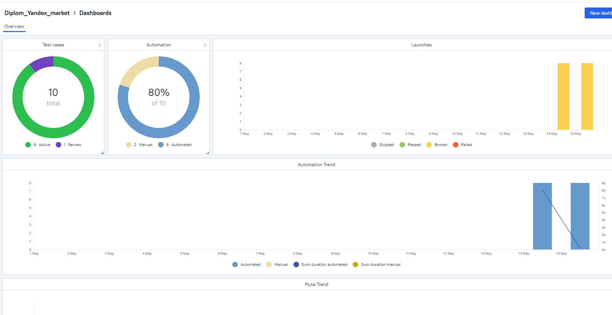
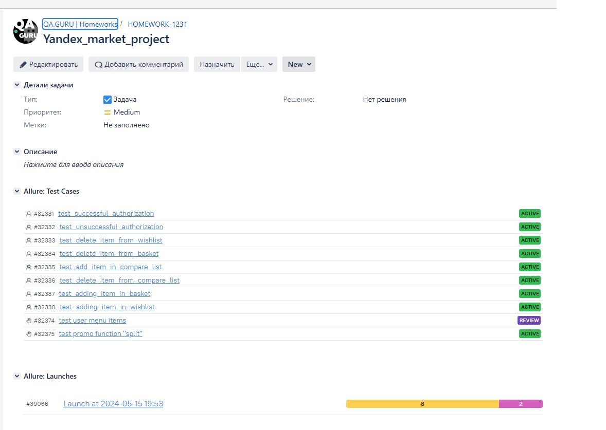
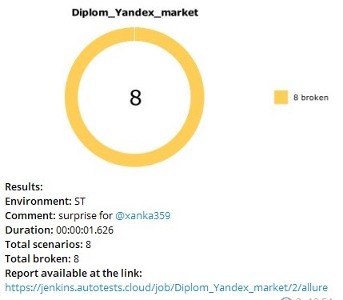

# Проект по автоматизации тестирования сайта Яндекс.Маркет

> <a target="_blank" href="https://market.yandex.ru/">Ссылка на сайт</a>


*** 

### Проект реализован на стеке

        

***  

### Особенности проекта

* Проект реализован с удаленным запуском на Selenoid, но школьный селеноид блокирует удаленный запуск, поэтому проверить
  можно только локально
* Оповещения о тестовых прогонах в Telegram
* Сборка проекта в Jenkins
* Отчеты Allure Report
* Интеграция с Allure TestOps
* Автоматизация отчетности о тестовых прогонах и тест-кейсах в Jira

----

### Реализованные проеверки

1. Авторизация с валидными данными
2. Авторизация с невалидными данными
3. Добавление продукта в избранное
4. Добавление продукта в корзину
5. Добавление продукта в список сравнения
6. Удаление продукта из корзины
7. Удаление продукта из списка сравнения

____

### [Проект](https://www.neoflex.ru/) в Jenkins

### Локальный запуск

**Для локального запуска необходимо выполнить:**

```bash
python -m venv .venv
source .venv/bin/activate
pip install -r requirements.txt
pytest -s -v
```

____
**Для получения отчета:**

```bash
allure serve build/allure-results
```

____

1. **Allure testops**  (запуск с селеноида)
   

___  

2. **Jira**  
   

___  

3. **Telegram**  (запуск с селеноида)
   
